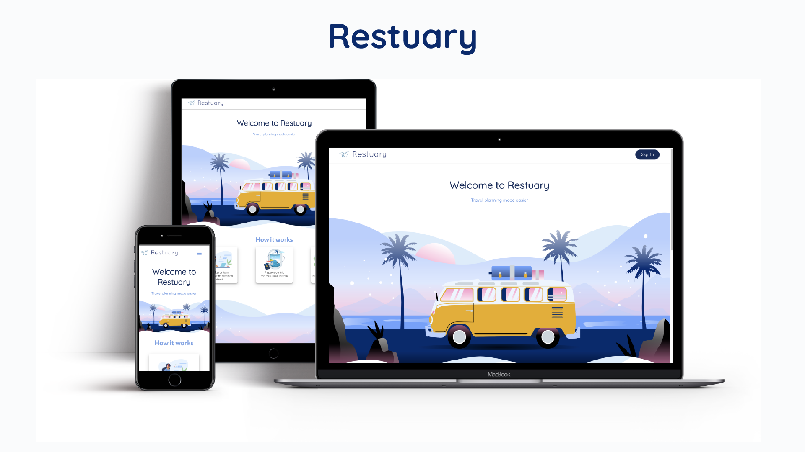

## Restuary

To install the project, run in the terminal:

- npm install
- npm start
- go to firebase.com
- copy and paste your API/database credentials in an .env file at the root of the project.

## Features

- Authentication (sign up, login, forgot password, google and facebook login)
- Homepage with a search bar to browse all the user's added places
- Form to add a place
- Explore page to quickly gather information about different countries (timezone, currency, capital city...)
- Personalized profile page
- Help page/doc
- Admin interface to delete users/places and send forgot password to user

## Tech stack

### Frontend

- React
- npm
- Material UI

### Backend

- Google services